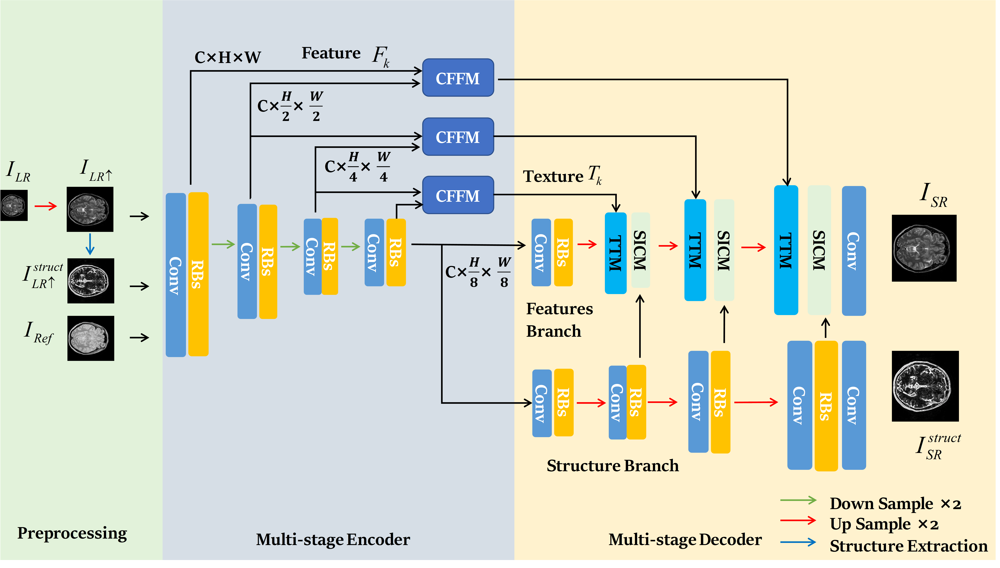

# [ICPR 24'] Edge-guided and Cross-scale Feature Fusion Network for Efficient Multi-contrast MRI Super-Resolution
**Zhiyuan Yang, Bo Zhang, Zhiqiang Zeng, Seo Yong Yeo**



In recent years, MRI super-resolution techniques have achieved great 
success, especially multi-contrast methods that extract texture information from 
reference images to guide the super-resolution reconstruction. However, current
methods primarily focus on texture similarities at the same scale, neglecting
cross-scale similarities that provide comprehensive information. Moreover, the 
misalignment between features of different scales impedes effective aggregation 
of information flow. To address the limitations, we propose a novel edge-guided 
and cross-scale feature fusion network, namely ECFNet. Specifically, we develop a pipeline consisting of the deformable convolution and the cross-attention 
transformer to align features of different scales. The cross-scale fusion strategy
fully integrates the texture information from different scales, significantly enhancing the super-resolution. In addition, a novel structure information collaboration module is developed to guide the super-resolution reconstruction with implicit structure priors. The structure information enables the network to focus on
high-frequency components of the image, resulting in sharper details. Extensive 
experiments on the IXI and BraTS2020 datasets demonstrate that our method 
achieves state-of-the-art performance compared to other multi-contrast MRI super-resolution methods, and our method is robust in terms of different super-resolution scales.

## Installation
```
git clone https://github.com/zhiyuan-yang/Edge-Guided-Cross-Scale-MRI-Super-resolution.git
```
## Requirements
```
pip install -r requirements.txt
```
## Datasets
[IXI dataset](https://brain-development.org/ixi-dataset/)

[BraTSDataset](https://www.med.upenn.edu/cbica/brats2020/data.html)
```
|-dataset
|---train
|---test

```

## Run
```
python train.py
```
## Cite
```
@InProceedings{10.1007/978-3-031-78398-2_14,
author="Yang, Zhiyuan
and Zhang, Bo
and Zeng, Zhiqiang
and Yeo, Si Yong",
title="Edge-Guided and Cross-Scale Feature Fusion Network for Efficient Multi-contrast MRI Super-Resolution",
booktitle="Pattern Recognition",
year="2025",
publisher="Springer Nature Switzerland",
address="Cham",
pages="208--218",
isbn="978-3-031-78398-2"
}
```
## Acknowledgement
We use some codes from [TTSR](https://github.com/researchmm/TTSR) and [DCAMSR](https://github.com/Solor-pikachu/DCAMSR). We would like to thank the authors for their great work.

